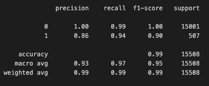

# Credit Risk Classification

## Overview

The goal of this project is to assess the creditworthiness of borrowers using a logistic regression model, based on historical loan data. The dataset includes financial information such as loan status (0 for healthy loans and 1 for high-risk loans) along with other details about the borrowers and their loans. The main objective is to predict whether a loan is healthy or poses a high risk of default.

## Dataset

The dataset includes the following financial information:
- **Loan Status**: Binary classification (0 for healthy, 1 for high-risk).
- **Features**: Borrower information including loan amount, annual income, debt-to-income ratio, and credit score.

The model was designed to predict the **loan status** based on these features to identify high-risk loans.

## Machine Learning Process

1. **Data Preprocessing**:
   - The dataset was split into features (**X**) and target (**y**), with **loan status** being the target.
   - Data was then split into training and testing sets using `train_test_split`.

2. **Model Training**:
   - A logistic regression model was created using the training data.
   - The logistic regression model was chosen due to its efficiency in binary classification tasks.

3. **Model Prediction**:
   - After training, the model was used to predict the loan status on the testing data.

4. **Model Evaluation**:
   - The model was evaluated using various metrics such as accuracy, precision, recall, F1-score, and confusion matrix.

## Results

### Logistic Regression Model:
- **Accuracy**: 99%
- **Precision**:
    - Healthy loans (0): 1.00
    - High-risk loans (1): 0.86
- **Recall**:
    - Healthy loans (0): 0.99
    - High-risk loans (1): 0.94
- **F1-Score**:
    - Healthy loans (0): 1.00
    - High-risk loans (1): 0.90

These results indicate that the model is highly effective in predicting healthy loans and has a good balance of precision and recall for high-risk loans.

### Confusion Matrix & Classification Report
Below is the classification report generated from the logistic regression model:

## Conclusion

The logistic regression model performs extremely well for both healthy and high-risk loans. It achieves almost perfect accuracy, precision, and recall for healthy loans and performs strongly on high-risk loans with minimal misclassification.

Given its robust performance, this model is recommended for credit risk classification. The high recall for high-risk loans ensures that the model minimizes missed high-risk loans, which is crucial in preventing financial losses.

## Resources

Here are the key libraries and resources used in this project:

- [Pandas](https://pandas.pydata.org/) – for data manipulation and analysis.
- [NumPy](https://numpy.org/) – for numerical computations.
- [Scikit-learn](https://scikit-learn.org/stable/) – for machine learning models and evaluation metrics.
- [Pathlib](https://docs.python.org/3/library/pathlib.html) – for file system path manipulation.

## Files in Repository

- `credit_risk_classification.ipynb`: Jupyter notebook containing the full analysis and code.
- `lending_data.csv`: The dataset used for training and testing.
- `Images/classification_report.png`: Visual representation of the classification report.
